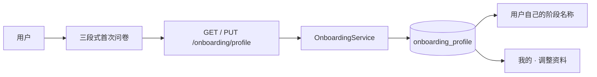

# 首次问卷与本机人生状态

让 Mainline 在第一次使用时先了解用户的真实阶段、现实限制和偏好。资料只保存在本机，用户始终可以跳过、回来编辑或改变想法。

## 实现流程图

## 能力边界

### 目标

- 首次进入时收集当前阶段、现实限制、常见干扰、奖励惩罚偏好和能力方向。
- 全部问题可跳过；空标题会以“当前阶段”保存，避免用一个必填项阻塞用户。
- 完成后把用户自己的阶段名称展示在应用顶部，并允许在“我的”页重新编辑。
- 保存内容与完整本机备份一同存在 SQLite，不上传、不分享。

### 非目标

- 不由问卷自动创建章节、目标、任务、奖励或惩罚。
- 不把这些文字自动发给 AI；用户后续请求 AI 规划时仍需要自己确认提供的上下文。
- 不建立云端档案、账号画像或可识别用户的分析数据。

## 核心规则

1. SQLite 只保存一份当前资料，第一次保存才标记为已完成问卷，后续编辑保留首次完成时间。
2. 开始和预计结束日期是可选的，但都必须是真实日期，且结束不能早于开始。
3. 表单从“现在、现实限制、想要的支持”三个低密度页面展开，用户能返回修改且不会因资料异步读入丢失正在输入的文字。
4. 资料读取失败时，应用仍保留可用的本地任务界面，不把网络或本机服务波动误判为用户未完成问卷。
5. 顶部和“我的”页只展示用户保存的事实，不使用演示阶段文案替代。

## 代码地图

- `apps/api/src/modules/onboarding/routes.ts`：读取和保存资料的 TypeBox HTTP 边界。
- `apps/api/src/modules/onboarding/service.ts`：日期、范围和默认阶段名规则。
- `apps/api/src/modules/onboarding/repository.ts`：唯一资料行的 SQLite 读写。
- `apps/web/src/features/onboarding/OnboardingContext.tsx`：跨页资料读取和保存状态。
- `apps/web/src/features/onboarding/OnboardingScreen.tsx`：三段式首次问卷与资料编辑界面。
- `apps/web/src/features/onboarding/ProfilePanel.tsx`：我的页面中的人生状态摘要。
- `apps/api/src/platform/database/migrations.ts`：资料表迁移。
- `apps/api/src/platform/backup/local-backup-service.ts`：资料导出。

## 主要测试

- `apps/api/src/modules/onboarding/routes.test.ts`：默认未完成、保存完成与日期范围校验。
- `apps/web/src/features/onboarding/OnboardingScreen.test.tsx`：用户可跳过内容、分步继续并保存自己的阶段名称。

## 变更记录

| 日期 | 变更 | 验证 |
| --- | --- | --- |
| 2026-08-14 | 新增本机三段式首次问卷、可编辑人生状态和个人资料备份 | `pnpm check` |
