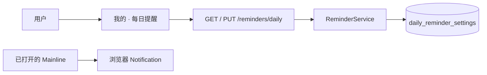

# 本机每日提醒

让用户为 Mainline 设置一个每天查看主线的提醒。提醒设置保存到本机 SQLite；浏览器通知仅在网页打开、且用户明确允许通知后触发。

## 实现流程图

## 能力边界

### 目标

- 保存一个可开关、可设定时间的本机每日提醒。
- 仅由用户点击“开启提醒”时请求浏览器通知权限。
- 在 Mainline 保持打开且到达设定分钟时，每天最多显示一次浏览器通知。
- 将提醒设置包含在用户主动下载的本机备份中。

### 非目标

- 不提供服务器推送、账号同步、PWA 后台推送或网页关闭后的通知承诺。
- 不代替用户决定提醒时间，也不自动更改任务或惩罚。
- 不发送任何提醒内容或用户数据到 AI、云端。

## 核心规则

1. SQLite 中只有一条提醒设置，默认关闭、时间为 `20:00`。
2. 时间必须是有效的 24 小时制 `HH:mm`；无效输入返回中文校验错误。
3. 开启通知的授权请求只能来自用户点击，遭拒后不会保存为开启状态。
4. 通知去重标记存放在浏览器本地存储，按本地日期确保每日最多一次。
5. “我的”页必须明确说明：网页完全关闭后不会推送。

## 代码地图

- `apps/api/src/modules/reminders/routes.ts`：提醒设置的 TypeBox HTTP 边界。
- `apps/api/src/modules/reminders/service.ts`：有效时间校验与写入规则。
- `apps/api/src/modules/reminders/repository.ts`：唯一提醒设置的 SQLite 读写。
- `apps/web/src/features/reminders/ReminderContext.tsx`：跨页加载设置和打开网页期间的通知调度。
- `apps/web/src/features/reminders/ReminderPanel.tsx`：用户可见的设置、授权与边界说明。
- `apps/api/src/platform/database/migrations.ts`：提醒设置表迁移。
- `apps/api/src/platform/backup/local-backup-service.ts`：提醒设置导出。

## 主要测试

- `apps/api/src/modules/reminders/routes.test.ts`：默认设置、有效保存和无效时间拒绝。
- `apps/web/src/features/reminders/ReminderPanel.test.tsx`：只有用户点击后才请求浏览器授权并保存。

## 变更记录

| 日期 | 变更 | 验证 |
| --- | --- | --- |
| 2026-08-14 | 新增本机每日提醒设置、浏览器通知和打开状态边界说明 | `pnpm check` |
