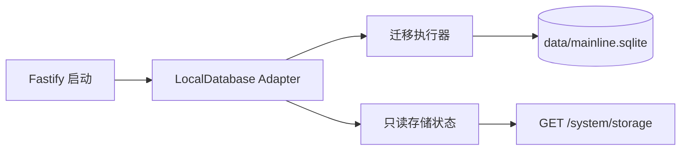

# 本地持久化

为 Mainline 提供单用户、本地优先的 SQLite 数据存储和可重复执行的迁移机制。

## 实现流程图

## 能力边界

### 目标

- 默认将数据保存到工作区本地 SQLite 文件。
- 使用 `schema_migrations` 记录已完成迁移。
- 支持测试使用内存数据库，不污染真实用户数据。
- 向本地 API 提供不含用户内容的存储就绪状态。

### 非目标

- 不提供任意 SQL 执行能力。
- 不允许 Web 直接连接 SQLite。
- 不存放 API Key、凭证图片二进制或云同步状态；凭据只在 SQLite 留存元数据，图片位于本机文件目录。

## 核心规则

1. SQL 只能位于本 Adapter 或后续领域 Repository，不能出现在 Fastify 路由。
2. 迁移一旦记录完成，不得在后续启动时重新执行。
3. 新业务表必须以新的、不可变的迁移加入；禁止修改既有迁移。
4. 浏览器只能获知存储是否可用，不能获知文件路径或数据内容。

## 代码地图

### 主要实现

- `apps/api/src/platform/database/local-database.ts`：SQLite 连接、路径解析和状态读取。
- `apps/api/src/platform/database/migrations.ts`：最小迁移清单、任务结果/奖励/承诺、章节目标、复盘、任务目标关联与凭据元数据及其执行器。
- `apps/api/src/modules/tasks/repository.ts`：第一个领域 Repository，在此 Adapter 连接上执行任务 SQL。
- `apps/api/src/app.ts`：应用生命周期中创建并关闭本地数据库。
- `apps/api/src/modules/system/routes.ts`：只读存储状态接口。
- `packages/contracts/src/index.ts`：存储状态响应契约。

### 主要测试

- `apps/api/src/platform/database/local-database.test.ts`：内存和文件数据库迁移回归。
- `apps/api/src/app.test.ts`：存储状态 API 响应。

## 变更记录

| 日期 | 变更 | 验证 |
| --- | --- | --- |
| 2026-08-14 | 建立本地 SQLite 与迁移基础 | `pnpm check` |
| 2026-08-14 | 新增任务表与单日有效主线唯一索引 | `pnpm check` |
| 2026-08-14 | 新增任务到目标的可空外键和查询索引 | `pnpm check` |
| 2026-08-14 | 新增惩罚凭据元数据表；图片文件仍只存本机目录 | `pnpm check` |
