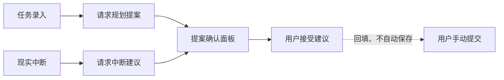

# AI 规划提案与现实中断（Web）

把 AI 结果作为可阅读、可忽略、可确认的建议呈现给用户。

## 实现流程图

## 核心规则

1. 页面不读取或保存任何 API Key。
2. 提案的确认和忽略必须是显式按钮，不能因关闭面板被默认接受。
3. 接受任务规划只回填当前表单；任务仍须由用户点击保存。
4. 中断建议要明确说明“不会自动修改今日任务”。

## 代码地图

- `api.ts`：AI 提案 API 客户端与响应校验。
- `TaskPlanSuggestion.tsx`：任务规划建议确认面板。
- `InterruptionComposer.tsx`：现实中断记录和建议确认。

## 变更记录

| 日期 | 变更 | 验证 |
| --- | --- | --- |
| 2026-08-14 | 接入任务规划回填与现实中断确认界面 | `pnpm check` |
