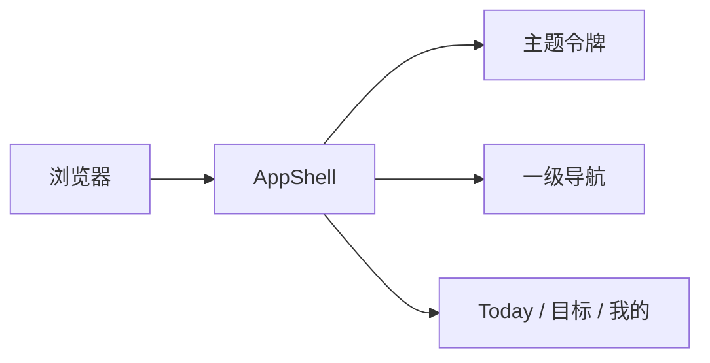

# 移动端应用外壳

为 Mainline 提供移动端优先的页面容器、主题和一级导航，使后续 Today、目标与设置功能拥有稳定入口。

## 实现流程图

## 能力边界

### 目标

- 展示全中文、移动端优先的应用外壳。
- 支持深色和亮色主题。
- 提供今天、目标、添加和我的四个一级入口。
- 在 API 未连接时展示可理解的本地提示。
- 将“记录”作为任务录入动作，而不是没有内容的独立页面。

### 非目标

- 不保存业务任务或用户资料。
- 不提供具体的 Today、目标或设置业务页面。
- 不读取浏览器中的 API 密钥。

## 核心规则

1. 底部导航只承载一级页面，二级流程使用独立路由或抽屉。
2. 应用壳为固定底部导航预留安全区域和内容空间。
3. 主题使用语义变量，业务组件不得直接写颜色常量。
4. 图标控件具有中文无障碍名称，所有点击目标至少为 44×44px。
5. Today、目标和我的业务事实各自归属功能模块，App 只负责将其挂入一级入口。
6. 应用壳可以挂载跨页的浏览器能力；每日提醒只在用户显式授权后、网页保持打开时运行。

## 代码地图

### 主要实现

- `apps/web/src/app/App.tsx`：应用壳、页面状态和离线降级。
- `apps/web/src/app/api.ts`：浏览器 API 响应读取与契约验证。
- `apps/web/src/styles/global.css`：双主题令牌、全局布局和组件样式。

### 主要测试

- `apps/web/src/app/App.test.tsx`：一级导航和 API 离线提示。

## 变更记录

| 日期 | 变更 | 验证 |
| --- | --- | --- |
| 2026-08-14 | 完成第一阶段应用外壳 | `pnpm check` |
| 2026-08-14 | 接入 Today，记录入口改为打开任务录入 | `pnpm check` |
| 2026-08-14 | 接入真实目标页与章节目标入口 | `pnpm check` |
| 2026-08-14 | 调整目标行信息层级，容纳关联任务数的低密度展示 | `pnpm check` |
| 2026-08-14 | 增加本机凭据缩略图和已选文件的语义样式 | `pnpm check` |
| 2026-08-14 | 挂载跨页的本机每日提醒 Provider，不引入后台推送 | `pnpm check` |
