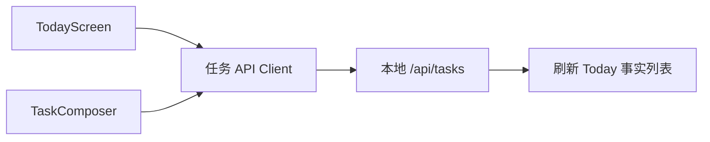

# Today 与任务管理（Web）

此目录是任务功能的浏览器入口；功能规则与 API 归属共同记录在 `apps/api/src/modules/tasks/FEATURE.md`。

## 实现流程图

## 核心规则

1. 用户操作发送到 API 后才刷新任务事实；React 状态只承载加载、表单和临时交互状态。
2. “记录”底栏按钮打开任务录入，不产生一个空白独立页面。
3. 同日主线冲突要保留服务端原始中文提示，不能在前端静默替换为其他分类。
4. 中文表单控制项必须有可见标签，提交过程不得重复提交。

## 代码地图

- `TodayScreen.tsx`：日期面板、任务列表、动作反馈。
- `TaskComposer.tsx`：创建和编辑面板。
- `api.ts`：任务请求与响应校验。
- `task-presentation.ts`：任务枚举对应的中文呈现。

## 变更记录

| 日期 | 变更 | 验证 |
| --- | --- | --- |
| 2026-08-14 | 完成 Today、任务录入与普通完成体验 | `pnpm check` |
