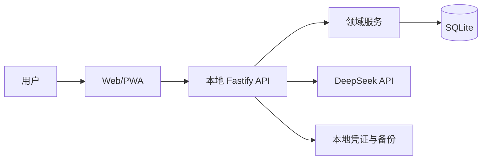

# Mainline 功能目录

功能文档与代码共同构成实现事实来源。每个功能在主 Owner 目录维护一份 `FEATURE.md`；跨工作区实现写入该文档的代码地图。

## 功能索引

| Feature ID | 功能 | 状态 | 主 Owner 文档 |
| --- | --- | --- | --- |
| `app-shell` | 移动端应用外壳、主题与基础导航 | active | `apps/web/src/features/shell/FEATURE.md` |
| `local-runtime` | 本地 API 健康检查、配置和运行边界 | active | `apps/api/src/modules/system/FEATURE.md` |
| `local-persistence` | SQLite 本地存储、迁移与存储状态 | active | `apps/api/src/platform/database/FEATURE.md` |
| `shared-contracts` | Web 与 API 共用的领域契约 | active | `packages/contracts/FEATURE.md` |

## 代码路径映射

| 路径 | 必须同步的 Feature ID |
| --- | --- |
| `apps/web/src/app/**`、`apps/web/src/styles/**`、`apps/web/src/features/shell/**` | `app-shell` |
| `apps/api/src/app.ts`、`apps/api/src/index.ts`、`apps/api/src/modules/system/**` | `local-runtime`、`local-persistence` |
| `apps/api/src/platform/database/**` | `local-persistence` |
| `packages/contracts/**` | `shared-contracts` |

后续新增 Today、任务、AI 提案、结果、契约和复盘功能时，需要先建立各自的主 Owner `FEATURE.md`，再补充此表。
