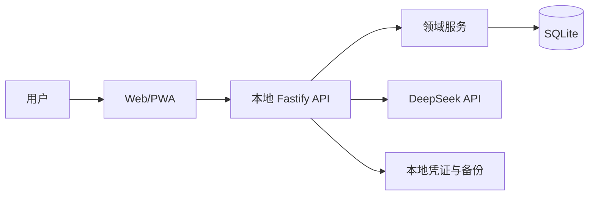

# Mainline 功能目录

功能文档与代码共同构成实现事实来源。每个功能在主 Owner 目录维护一份 `FEATURE.md`；跨工作区实现写入该文档的代码地图。

## 功能索引

| Feature ID | 功能 | 状态 | 主 Owner 文档 |
| --- | --- | --- | --- |
| `app-shell` | 移动端应用外壳、主题与基础导航 | active | `apps/web/src/features/shell/FEATURE.md` |
| `local-runtime` | 本地 API 健康检查、配置和运行边界 | active | `apps/api/src/modules/system/FEATURE.md` |
| `local-persistence` | SQLite 本地存储、迁移与存储状态 | active | `apps/api/src/platform/database/FEATURE.md` |
| `task-management` | Today、任务录入、任务生命周期与数据库规则 | active | `apps/api/src/modules/tasks/FEATURE.md` |
| `chapters-and-goals` | 多领域章节、目标与用户手动进度 | active | `apps/api/src/modules/goals/FEATURE.md` |
| `reviews-and-memory` | 每日复盘与用户选择的本地长期记忆 | active | `apps/api/src/modules/reviews/FEATURE.md` |
| `ai-proposals` | DeepSeek 规划提案、确认与现实中断建议 | active | `apps/api/src/modules/ai-proposals/FEATURE.md` |
| `daily-reminders` | 本机每日提醒设置与打开网页期间的浏览器通知 | active | `apps/api/src/modules/reminders/FEATURE.md` |
| `initial-onboarding` | 首次问卷、可编辑人生状态与本机背景资料 | active | `apps/api/src/modules/onboarding/FEATURE.md` |
| `shared-contracts` | Web 与 API 共用的领域契约 | active | `packages/contracts/FEATURE.md` |

## 代码路径映射

| 路径 | 必须同步的 Feature ID |
| --- | --- |
| `apps/web/src/app/**`、`apps/web/src/styles/**`、`apps/web/src/features/shell/**` | `app-shell` |
| `apps/api/src/app.ts`、`apps/api/src/index.ts`、`apps/api/src/modules/system/**` | `local-runtime`、`local-persistence` |
| `apps/api/src/platform/database/**` | `local-persistence` |
| `apps/api/src/platform/backup/**` | `local-persistence` |
| `apps/api/src/modules/tasks/**` | `task-management` |
| `apps/api/src/platform/evidence/**` | `task-management` |
| `apps/api/src/modules/goals/**` | `chapters-and-goals` |
| `apps/api/src/modules/reviews/**` | `reviews-and-memory` |
| `apps/web/src/features/tasks/**` | `task-management` |
| `apps/web/src/features/goals/**` | `chapters-and-goals` |
| `apps/web/src/features/reviews/**` | `reviews-and-memory` |
| `apps/api/src/modules/ai-proposals/**`、`apps/api/src/platform/ai/**` | `ai-proposals` |
| `apps/web/src/features/ai-proposals/**` | `ai-proposals` |
| `apps/api/src/modules/reminders/**`、`apps/web/src/features/reminders/**` | `daily-reminders` |
| `apps/api/src/modules/onboarding/**`、`apps/web/src/features/onboarding/**` | `initial-onboarding` |
| `packages/contracts/**` | `shared-contracts` |

后续新增 Today、任务、AI 提案、结果、契约和复盘功能时，需要先建立各自的主 Owner `FEATURE.md`，再补充此表。
