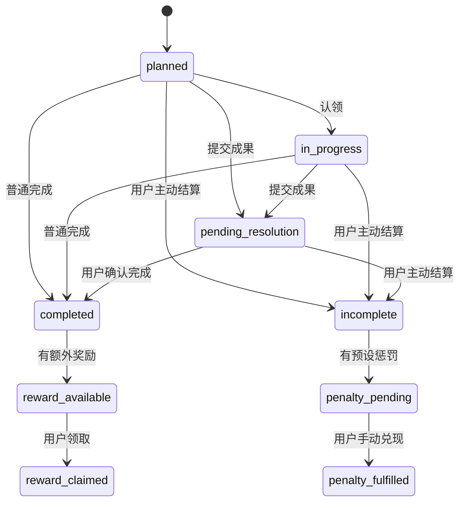

# Story 05：结果、奖励与承诺

## 目标

让 Mainline 从“列任务”形成最小执行闭环：普通任务完成后获得经验与可领取奖励；需要产出的任务先提交结果、再由用户确认完成；未完成任务由用户主动结算，并生成自己预先选定的惩罚待办。

## 范围

- 为任务增加完成方式、经验值、可选实物/权益奖励与预先承诺的惩罚；
- 普通任务可直接完成并获得经验，额外奖励变为可领取状态；
- 成果任务需提交成果说明与自评，再由用户确认完成或按未完成结算；
- 未完成不自动滚入明天；若设置承诺，创建 24 小时内待兑现的惩罚记录；
- 支持领取奖励、手动标记惩罚已兑现，以及查看个人经验、待领取奖励与待兑现惩罚；
- Today 提供成果提交和未完成结算入口；“我的”展示最小进度存档。

## 非目标

- 不自动判断成果质量或自动增减经验；本故事以用户自评作为事实。
- 不直接转账、不调用支付、不上传或识别惩罚凭证图片。
- 不实现 AI 奖励生成、AI 成果评分或可消费经验；这些依赖后续偏好、证据和提案能力。
- 不因日期到达自动将任务设为失败，也不强制用户接受任何惩罚。

## 模型与状态

## 核心规则

1. `direct` 是普通任务，点击完成后立即写入完成事实及经验；`result_report` 必须先提交成果和自评，不能直接完成。
2. 用户的成果自评只影响该任务最终经验值；系统不把自评当作 AI 或外部客观判断。
3. 创建时设置的奖励与惩罚是承诺快照；任务进入 `in_progress` 后不会通过普通编辑接口被改写。
4. `incomplete` 必须由用户主动触发。未完成时额外奖励作废；有惩罚承诺才进入 `pending`，并将兑现期限设为当前时间后 24 小时。
5. 奖励领取和惩罚兑现都是用户显式事实操作；本地系统只记录，不执行现实转账或现实行为。
6. 经验只会累计，不可消费；阶段性总经验由已完成任务的已授予经验汇总。

## 验收标准

1. 普通任务完成后有经验记录；有额外奖励时，用户可在 Today 或“我的”领取。
2. 成果任务必须填写成果与自评，才可进入用户确认完成的状态。
3. 用户可对未完成任务主动结算；系统绝不因过期自动结算或改期。
4. 金钱、身体和自定义三类惩罚可被记录为待兑现项，时间限制为 24 小时，并可手动标记完成。
5. 任务、奖励和惩罚在刷新后仍从 SQLite 返回；Web 不将其作为事实源缓存。
6. API 覆盖直接完成、成果确认、未完成、领取奖励、惩罚兑现和进度汇总；Web 覆盖关键确认操作。
7. 通过 `pnpm check`、`git diff --check` 后独立提交。
