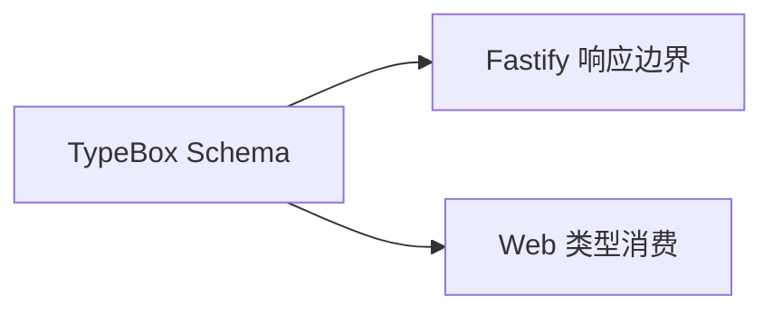

# 共享契约

为 Web 与 API 提供稳定的 TypeScript 类型和 TypeBox Schema，避免客户端自行猜测接口结构。

## 实现流程图

## 能力边界

### 目标

- 集中维护跨工作区 DTO 和状态枚举。
- 让 API 使用同一份 Schema 校验输出。
- 让 Web 使用静态类型读取 API 结果。

### 非目标

- 不承载领域服务。
- 不连接数据库。
- 不保存运行时状态。

## 核心规则

1. 跨 API 边界的对象先定义在本包，再由 API 和 Web 消费。
2. 修改 DTO 时必须同步修改所有消费者的功能文档和测试。
3. TypeBox Schema 是 API 运行时边界，静态类型由 Schema 推导。

## 代码地图

### 主要实现

- `packages/contracts/src/index.ts`：健康检查、存储状态、任务/结果/进度 DTO、请求和响应 Schema。

### 主要测试

- 由 API 健康检查测试验证 Schema 与实际响应一致。

## 变更记录

| 日期 | 变更 | 验证 |
| --- | --- | --- |
| 2026-08-14 | 完成健康检查与存储状态 TypeBox 契约 | `pnpm check` |
| 2026-08-14 | 完成任务 API TypeBox 契约 | `pnpm check` |
| 2026-08-14 | 扩展成果结算、奖励承诺与进度快照契约 | `pnpm check` |
| 2026-08-14 | 扩展多领域章节、目标与进度契约 | `pnpm check` |
